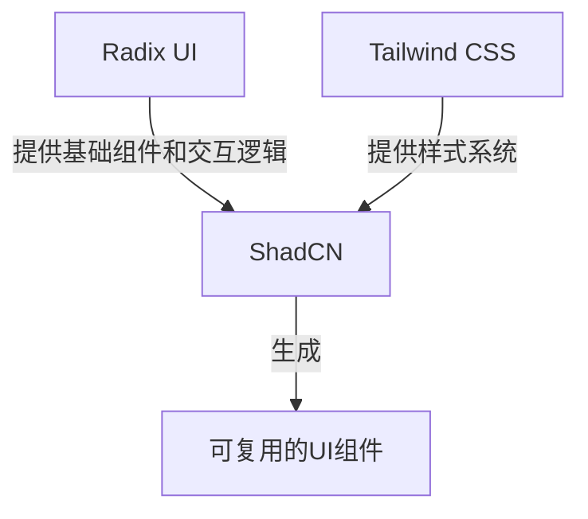

# Tailwind CSS、ShadCN 和 Radix UI 的关系

## 概述

Tailwind CSS、ShadCN 和 Radix UI 是现代前端开发中三个强大的工具，它们相互配合，形成了一个完整的 UI 开发解决方案。



## 三者的核心定位

### 1. Tailwind CSS

> 一个实用优先的 CSS 框架，提供原子化的样式类。

- ✨ **核心特点**

  - 原子化 CSS 类（如：`flex`, `p-4`, `text-center`）
  - 高度可定制的设计系统
  - 响应式设计支持
  - 暗色模式支持

- 🔧 **主要职责**
  - 为组件提供样式基础
  - 实现响应式布局
  - 主题定制能力

### 2. Radix UI

> 一个无样式、注重可访问性的 React 组件库。

- ✨ **核心特点**

  - 无样式组件
  - 完善的键盘支持
  - WAI-ARIA 规范实现
  - 专注于交互逻辑

- 🔧 **主要职责**
  - 提供组件交互逻辑
  - 确保可访问性
  - 处理复杂的状态管理

### 3. ShadCN

> 基于 Radix UI 和 Tailwind CSS 的组件库生成器。

- ✨ **核心特点**

  - 可复制的组件代码
  - 零运行时依赖
  - 高度可定制
  - CLI 工具支持

- 🔧 **主要职责**
  - 整合 Radix UI 和 Tailwind CSS
  - 提供预设组件样式
  - 简化组件使用流程

## 实际应用示例

### 按钮组件示例

1. **Radix UI 基础结构**

```tsx
import * as Button from "@radix-ui/react-button";

<Button.Root>点击按钮</Button.Root>;
```

2. **添加 Tailwind CSS 样式**

```tsx
<Button.Root className="px-4 py-2 bg-blue-500 hover:bg-blue-600 text-white rounded-lg">
  点击按钮
</Button.Root>
```

3. **使用 ShadCN 封装后的组件**

```tsx
import { Button } from "@/components/ui/button";

<Button variant="default">点击按钮</Button>;
```

## 最佳实践建议

### 初学者使用建议

- 🌟 直接使用 ShadCN 的预设组件
- 🎨 通过 Tailwind 类进行简单样式调整
- 📚 学习基本的组件使用方式

### 进阶使用建议

- 🔍 深入理解 Radix UI 的 API
- 🎯 使用 Tailwind CSS 创建自定义变体
- 🛠️ 基于 ShadCN 源码定制组件

### 高级使用建议

- 💡 直接使用 Radix UI 构建复杂交互
- 🎨 结合 Tailwind CSS 创建设计系统
- 🔧 深度定制 ShadCN 组件

## 总结

三者在现代前端开发中扮演着不同但互补的角色：

- **Radix UI** 专注于组件逻辑和可访问性
- **Tailwind CSS** 提供灵活的样式解决方案
- **ShadCN** 将两者优雅地结合，提供即用型组件

通过这三个工具的协作，开发者可以快速构建出美观、功能完善且具有良好可访问性的现代 Web 应用。
