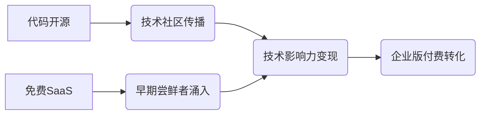

# AI 应用平台竞品深度解析：Coze 与 Dify 的生态位争夺及 AP 的破局策略

## 一、Coze：从 ToC 到"泛智能应用"平台的转型困境

### 1. 产品定位与战略摇摆

Coze 最初以完全的 ToC 定位切入市场，其核心特色是建立了一个公共应用市场/广场，允许用户发布和共享自己搭建的智能体。然而，这种模式在实践中被证明难以持续：

- **市场活跃度低下**：公共市场中的应用多数缺乏吸引力，用户参与度不高
- **能力天花板明显**：早期版本无法支持复杂应用的构建，限制了创新空间

字节跳动内部显然也意识到这一问题，其企业级产品 HiAgent（集成豆包大模型+云服务器）在资源投入上已超过 Coze，反映出对 ToB 方向的倾斜。

### 2. 关键转型：AP+AS 融合

Coze 近期通过引入类似影刀 AppStudio 的复杂页面搭建能力，实现了从单一对话智能体平台(AP)向"泛智能应用"平台的转变：

- **能力扩展**：现支持完整应用前端开发，应用多样性显著提升
- **形态进化**：形成智能体搭建+应用开发的复合平台

然而，这种转型并未解决根本问题：**仍未明确个人与企业场景的价值优先级**。当前企业用户使用 Coze 更多是因其易用性，而非结构性优势。

### 3. AP 可借鉴的经验

- **用户体验细节**：Coze 在交互设计上的精益求精（特别是对非技术用户友好）
- **快速迭代能力**：从单一功能到复合平台的敏捷转型
- **可视化构建**：低代码/无代码的页面编排方式

## 二、Dify：开发者生态的精准卡位

### 1. 增长飞轮构建

Dify 通过两个关键策略实现了快速增长：



### 2. 清晰的生态定位

Dify 将自己定位为"更好用的 LangChain"，准确抓住了开发者需求：

- **技术深度**：支持自定义 Workflow 和 Agent 推理逻辑
- **部署灵活**：完善的 K8s/私有化支持
- **生态丰富**：200+API 连接器

但短板同样明显：**业务用户使用门槛过高**，需要理解 LLM 底层概念。

### 3. AP 的可借鉴策略

- **分层开源**：社区版（基础功能）+专业版（企业级功能）
- **技术民主化**：隐藏复杂参数，提供业务友好界面
- **场景模板**：预置销售、客服等高需求场景方案

## 三、AP 的差异化破局之道

### 1. 坚定 ToB 定位的结构性优势

| **维度** | **Coze**   | **Dify**   | **AP 策略**      |
| -------- | ---------- | ---------- | ---------------- |
| 目标用户 | 个人开发者 | 技术团队   | 业务部门+IT 部门 |
| 部署方式 | 公有云     | 混合云     | 私有化优先       |
| 核心价值 | 应用共享   | 技术自由度 | 业务闭环         |
| 典型场景 | 娱乐/工具  | POC 验证   | 生产系统集成     |

### 2. 三维突破策略

1. **能力融合**：

   - 将智能体构建(AP)与业务应用开发(AS)深度整合
   - 示例：销售分析场景的端到端支持

   ```mermaid
   graph LR
   A[数据接入] --> B[智能清洗]
   B --> C[多维度分析]
   C --> D[报告生成]
   D --> E[审批触发]
   ```

2. **体验升级**：

   - 业务人员"零 AI 知识"设计
   - 技术人员的"专家模式"切换

3. **生态构建**：
   - 垂直行业解决方案包（销售/客服/HR 等）
   - 认证合作伙伴计划

### 3. 全球化布局路径

1. **合规先行**：预置 GDPR/CCPA 等区域合规组件
2. **本地化运营**：建立区域开发者社区
3. **分层产品**：
   - 社区版（开源获客）
   - 企业版（核心盈利）
   - 行业版（增值服务）

## 四、战略启示：穿越结构的增长逻辑

1. **生态位验证**：通过 A/B 测试同时探索：

   - 技术增强路径（开发者生态）
   - 业务简化路径（业务用户直达）

2. **结构性优势构建**：

   - 企业级功能隐形化（如权限管理融入业务流程）
   - 与现有业务系统深度对接（ERP/CRM 等）

3. **风险对冲**：
   - 保持架构灵活性，避免过早固化
   - 监控 HiAgent 等企业级竞品动态

**最终结论**：AI 应用平台战场正在分化，AP 的机会在于成为"业务人员的 AI 工作台"，这需要既吸收 Coze 的体验精髓，又借鉴 Dify 的生态策略，最终构建出独特的 ToB 价值网络。产品演进的本质不是功能堆砌，而是找到最适合企业 AI 落地"最后一公里"的解决方案。
